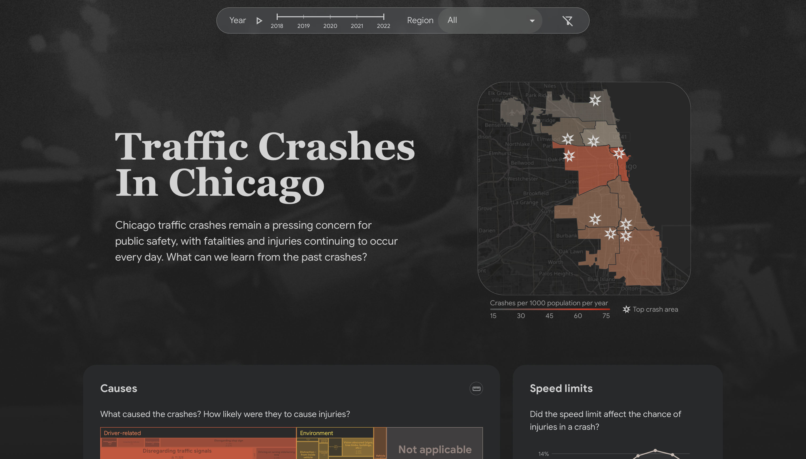

# Traffic Crashes in Chicago - Data Visualization

## Visit

Dashboard website: https://????.vercel.app

## Local installation 

1. Clone the files down to your directory, `git clone https://github.com/eddyyet/????.git`
2. The repo root directory contains 1 folder, `????`. Use `cd ????` to enter the folder.
3. Use `npm install` to install the dependencies.
4. Use `npm start` to start the application in your browser.

## Source of data, tools and images

#### Data
- Traffic Crashes in Chicago: [Chicago Data Portal](https://data.cityofchicago.org/Transportation/Traffic-Crashes-Crashes/85ca-t3if)
- Chicago Community Areas: [Chicago Data Portal](https://data.cityofchicago.org/Facilities-Geographic-Boundaries/Boundaries-Neighborhoods/bbvz-uum9)
- Chicago Population: [Chicago Metropolitan Agency for Planning](https://www.cmap.illinois.gov/documents/10180/126764/_Combined_AllCCAs.pdf/)

#### Map engine
- Leaflet: [Leaflet](https://leafletjs.com/)
- OpenStreetMap: [OpenStreetMap](https://www.openstreetmap.org/copyright)

#### Images
Images are deviated from the following:
- Crash scene photo: [NBC Chicago](https://www.nbcchicago.com/news/local/stolen-car-was-driving-wrong-way-before-fiery-chicago-crash-that-left-2-dead-16-hurt-police/3005211/)